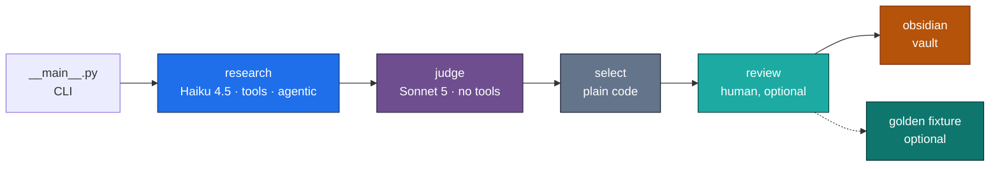
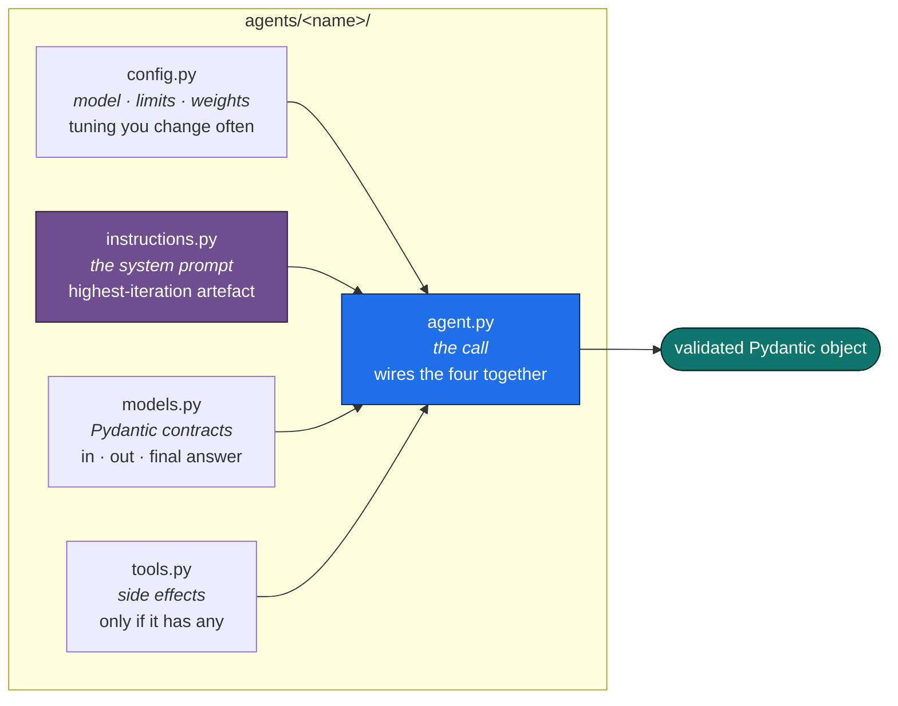
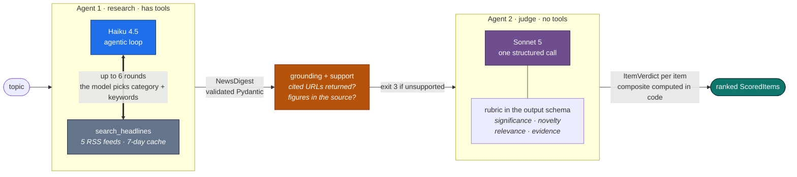
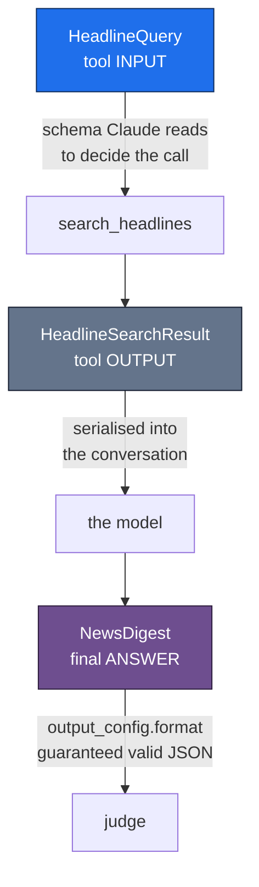
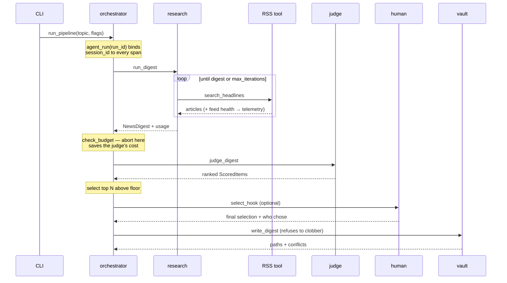

# Architecture

**What the system is, how it is layered, and what enforces the layering.**

Reasoning is inline, next to the thing it justifies, rather than in a separate
decision log.

---

## The system in one picture



**Exactly one stage is agentic.** Research is a `tool_runner` loop where the
model genuinely decides what to search for. Everything after it is
deterministic: selection is a rule, persistence is a file write. Wrapping the
whole thing in a second agent would add latency, cost and failure modes to buy
nothing: *"only the top 3 enter the vault"* is a rule, not a judgement call.

The vault write is the **only** operation that mutates state outside the
process. That is why it carries `side_effect: true` in telemetry.

---

## Layers

```
core  ←  agents/research  ←  agents/judge  ←  sinks  ←  orchestrator
                                 ↖  evals
```

Arrows point the way imports are allowed to go.

| Layer | May import | Holds |
|---|---|---|
| `core` | nothing internal | telemetry, pricing, provenance, budget, env, types |
| `agents/research` | `core` | the tool loop, RSS fetching, grounding check |
| `agents/judge` | `core`, `agents/research` | scoring, ranking, the composite |
| `sinks` | `core`, both agents | the Obsidian writer |
| `review` | `core`, both agents | terminal human-in-the-loop |
| `evals` | `core`, both agents | golden fixtures, replay |
| `orchestrator` | everything above | the pipeline |

Two restrictions carry real weight:

**`core` knows about nobody.** The moment it imports an agent, "shared" has
become "everything" and the folder names stop meaning anything. `core.telemetry`
therefore takes primitives — strings, numbers, bools — and callers do the
mapping from domain objects.

**`evals` may not import `sinks` or `orchestrator`.** This is an economic
argument encoded as a rule. Replay re-runs the *judge alone* against a frozen
digest, which is why iterating on the rubric costs about a cent. One
orchestrator import would silently drag research and vault writes back into
every replay.

`ScoredItem` lives in `agents/judge/models.py`, not `core`, because it composes
a research `DigestItem` with a judge `ItemVerdict` — putting it in the shared
layer would drag both agents into it.

### This is enforced, not documented

[`tests/test_architecture.py`](../tests/test_architecture.py) parses every
module's AST, resolves relative imports to layer names, and fails on a
violation. It also asserts:

- every agent has the same five files (`__init__`, `agent`, `config`,
  `instructions`, `models`) whether or not it uses tools
- prompts live in `instructions.py`, never inline in `agent.py`
- no agent `config.py` mentions an API key
- there is no per-agent `.env`

A folder structure is a claim about dependencies, and an unchecked claim
quietly stops being true the first time someone adds a convenient import. The
guard has a guard: `test_there_are_modules_to_check` fails if a path typo would
make every other assertion vacuously pass.

---

## Inside an agent

Both agents have the same five files, whether or not they use tools. The judge
has no tools and no loop — it is one structured call — but it keeps the shape,
so you always know where to look.



A test enforces all five exist. Consistency is the point: the judge having a
`tools.py`-shaped hole tells you at a glance that it deliberately has none.

### Agent 1 hands off to Agent 2

Two agents, deliberately different shapes. The first has tools and a loop
because it has to go and find things. The second has neither, because scoring
a list that is already in front of it requires no fetching and mutates
nothing.



**A different model on purpose.** Models exhibit self-preference bias — they
rate their own output more highly. A Haiku judge grading a Haiku digest is
marking its own homework, and the failure mode is invisible: you never see a
bad score, so you conclude quality is high.

**The handoff is a validated object, not text.** Agent 2 receives a
`NewsDigest` that already passed schema validation and two grounding checks.
It never sees raw feed HTML, and it never has to parse anything.

**Agent 2 cannot act.** No tools means no fetching, no writing, no way for an
injected instruction to reach anything outside the conversation. Combined with
`Literal[1..5]` scores, the worst a hostile headline can do is influence a
number inside a fixed range — which a human then reviews.

Three details in Agent 1 that are easy to leave out:

**ContextVars are bound before the loop, not passed through it.** The tool
signature is what Claude reads, so putting `window_days` there would let the
model choose it and cost tokens describing a setting the operator owns.

**Sanitising happens on the way in.** Feed text is neutralised at the parsing
boundary, so every downstream consumer gets the safe form by default rather
than each one having to remember.

**The checks run after a successful parse, not instead of it.** A digest can be
perfectly well-formed and still assert things its sources never said — schema
validation and grounding answer different questions.

---

## Module map

```
src/news_agent/
├── __main__.py                 CLI, flag validation, exit codes
├── orchestrator.py             research → judge → select → persist
├── review.py                   terminal review, command parsing
│
├── agents/
│   ├── research/
│   │   ├── agent.py            tool_runner loop + grounding check
│   │   ├── config.py           model, max_tokens, iteration bounds
│   │   ├── instructions.py     SYSTEM_PROMPT
│   │   ├── models.py           HeadlineQuery, Article, NewsDigest
│   │   └── tools.py            RSS fetching, feed health (stdlib only)
│   └── judge/
│       ├── agent.py            scoring, ranking, quality evals
│       ├── config.py           model, WEIGHTS, MIN_COMPOSITE, EFFORT
│       ├── instructions.py     JUDGE_SYSTEM
│       └── models.py           ItemVerdict, JudgeVerdicts, ScoredItem
│
├── evals/golden.py             fixture capture, replay, decision rule
├── sinks/obsidian.py           vault writer, path safety, conflict guard
└── core/
    ├── budget.py               the hard spend ceiling
    ├── doctor.py               --check preflight
    ├── env.py                  .env loading
    ├── observability.py        Langfuse setup, @observe, no-op fallback
    ├── pricing.py              per-bucket cost maths
    ├── provenance.py           version, prompt hash, resolved model
    ├── telemetry.py            the three levels
    └── types.py                TokenUsage
```

---

## The three Pydantic layers

Models are not decoration here; each one is a contract with a different party.



1. **Tool input.** Field descriptions here are *prompt engineering*, not
   documentation — they are what Claude reads when deciding how to call.
2. **Tool output.** Serialised back into the conversation, and **re-sent on
   every subsequent turn**. Anything added to this model is paid for
   repeatedly, which is why feed diagnostics go to telemetry instead.
3. **Structured answer.** Handed to the API via `output_config.format`, so the
   last message is guaranteed-valid JSON rather than prose to regex.

Constraints on layer 3, all learned the hard way:

- `extra="forbid"` is required (it emits `additionalProperties: false`)
- no field may have a default, or it drops out of `required`
- `ge`/`le` are **silently ignored**; enums are enforced, hence `Literal[1..5]`
- field declaration order is generation order, which is load-bearing for the
  judge: `reasoning` before scores

---

## Request flow, end to end



Three things worth noticing in that diagram:

**The budget check sits between research and the judge.** That is the only
point where stopping still saves money — research is already paid for, the
judge has not started. A check after the judge would be a report, not a guard.

**The human sees the whole ranking, not just the top N.** The point of review
is being able to promote something the cut-off excluded.

**`select_hook` is injected, not called.** The orchestrator has no terminal I/O
in it, so it stays testable and `review.py` owns the interaction.

---

## Cross-cutting concerns

| Concern | Where | Note |
|---|---|---|
| Tracing | `core/observability.py` | Fully optional; no keys → no behaviour change |
| Levelled telemetry | `core/telemetry.py` | See [observability.md](observability.md) |
| Cost | `core/pricing.py` | Four mutually exclusive token buckets |
| Spend ceiling | `core/budget.py` | `--max-usd`, aborts between stages |
| Provenance | `core/provenance.py` | Version, prompt hash, resolved model |
| Evaluation | `evals/golden.py` | See [evaluation.md](evaluation.md) |

**Two invariants the tests enforce, because both fail silently by design:**

1. **No keys → no behaviour change.** Every telemetry emitter is a no-op
   without a client.
2. **A broken sink never breaks a run.** Every adapter swallows exceptions —
   which is exactly why they need tests, since nothing else will ever tell you
   telemetry stopped working.

The exception to (2) is `agent_run`, which uses `ExitStack` rather than a
`try/except` around its `yield`. Wrapping the yield made the context manager
yield twice on an exception, turning a clean domain error into
`RuntimeError: generator didn't stop after throw()`. The telemetry safety net
was corrupting the very errors it existed not to touch. Only *setup* may fail
silently; the body's exceptions pass through untouched.

---

## Dependencies

Runtime: `anthropic`, `pydantic`. Optional: `langfuse`. That is the whole list.

RSS parsing is stdlib `urllib` + `ElementTree` — about 60 lines — rather than
`feedparser`, because the parsing is simple enough that the dependency would
cost more than it saves.
