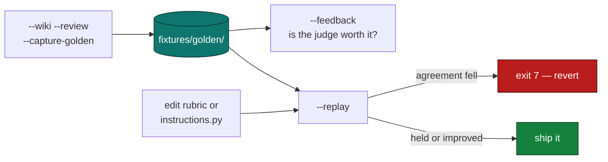

# Evaluation

**Observability tells you what a run did. Evaluation tells you whether a change
made it worse.** They are not the same thing, and this project had the first
without the second for most of its life.

The gap that motivated all of this: 250 tests cover the *code*. Nothing covered
the *prompts*. Editing the judge rubric shipped blind — you would have found a
regression by vaguely noticing the digests felt worse, weeks later.

---

## Ground truth you already produce

Every `--wiki --review` run generates a labelled example as a by-product:

- a digest (the input)
- the judge's ranking (the prediction)
- what a human actually filed (the label)

That is the most expensive signal to collect in most LLM systems, and here it
falls out of someone doing their job. It was being thrown away.

```bash
python -m news_agent "AI" --wiki --review --capture-golden
```

Writes `tests/fixtures/golden/YYYY-MM-DD-topic.json`:

### Building the dataset in one sitting

```bash
python -m news_agent --topics-file topics.txt
```

Runs each topic in the file as a full capture, resuming where it stopped —
already-captured topics are skipped, keyed on the **topic** rather than the
filename, because the filename carries a date and matching on that would
re-run the whole list the next morning.

The shipped `topics.txt` spans research, industry, policy and infrastructure
on purpose. A dataset of twenty near-identical topics measures the judge on
one kind of story and tells you nothing about the rest.

If a topic comes back thin, press `q`. An aborted run is better ground truth
than three weak stories filed because they were the only ones there — and the
batch moves on to the next topic rather than treating it as a failure.

### Capture requires a human, and the code enforces it

With no terminal the review falls through and `selected` is still the judge's
own pick. A fixture written then would record *"the human agreed"* when no
human was present — and twenty of those make `--feedback` report 100%
acceptance and recommend dropping `--review`, on the strength of reviews that
never happened.

`ReviewOutcome.reviewed` distinguishes the two cases, which `overridden`
cannot: "a person read the ranking and agreed" and "nobody was there" produce
an *identical* selection and mean opposite things. Capture refuses without it,
and `--topics-file` refuses upfront rather than billing for every topic to
produce an empty dataset.

```jsonc
{
  "topic": "AI",
  "captured": "2026-08-13",
  "digest": { /* the full NewsDigest */ },
  "judge_ranked":   [0, 1, 2, 3, 4, 5, 6],
  "judge_selected": [0, 1, 2],   // what the judge wanted
  "human_selected": [4, 5, 6],   // what you actually filed
  "command": "5 6 7"             // how you disagreed
}
```

**Indices, not copies.** A duplicated item could drift out of sync with the
digest it came from, and nothing would say which one was right.

**Both selections, not one.** `selected` alone cannot answer *"did the human
disagree?"* once the review hook has replaced it — which is why
`PipelineResult` carries `judge_selected` separately.

---

## The regression gate

```bash
python -m news_agent --replay
python -m news_agent --replay --replay-limit 5 --judge-model claude-opus-5
```

Re-judges every frozen digest and compares against your picks.

```
  REPLAY — 12 fixture(s)
  ──────────────────────────────

  agreement with you, as captured : 71%
  agreement with you, now         : 84%   (improved)
```

**Exit code 7 when agreement falls.** A gate that only reports is a dashboard,
and there is already one of those.

The comparison is *now* versus *as captured*, never against an absolute bar. A
rubric is only better or worse than the one it replaced; there is no
context-free score that says a judge is good.

### Why this is cheap

Replay re-runs the **judge only**. Research — the expensive,
non-deterministic, network-bound half — is frozen in the fixture. That is why
`evals` is forbidden from importing `orchestrator` or `sinks`, and why a test
enforces it: one convenient import would turn a one-cent replay into a full
paid run, silently.

| | Full run | Replay |
|---|---|---|
| Research | ~$0.02 | frozen |
| Judge | ~$0.01 | ~$0.01 |
| Vault write | yes | never |
| Deterministic input | no | yes |

---

## The metric

**Set overlap between the judge's selection and the human's.**

```python
agreement([0, 1, 2], [2, 1, 0]) == 1.0     # order does not matter
agreement([0, 1, 2], [0, 1, 3]) == 2/3
```

Not rank correlation. The decision this system makes is *"which items get
filed"* — a reordering within the chosen three changes nothing downstream, so a
metric that punished it would be measuring something nobody acts on.

---

## Is the judge worth its cost?

```bash
python -m news_agent --feedback     # local files only, no key, no spend
```

`judge_accepted` was being collected and never read. An unread metric is one
you pay to collect and never act on, so it now has a threshold **and a
decision**:

### Two rates, because there are two ways to disagree

A single acceptance number was actively misleading, and the first 16 real
fixtures proved it:

```
exact match      :  69%   you changed nothing
ranking held     :  94%   you kept every pick (1 swap)
floor too strict :  25%   you added back a dropped item (4)
```

Four of the five overrides **added** items while keeping every one the judge
picked — and each landed on exactly `top_n`. That is not the judge ranking
badly; it is `MIN_COMPOSITE` cutting something worth filing. The two have
different fixes in different files:

| Disagreement | What it means | Fix |
|---|---|---|
| You **removed** a pick | The judge ranked wrong | rewrite `instructions.py` |
| You only **added** | The floor cut too much | one constant in `config.py` |

Collapsing them meant a judge working 94% of the time reported as 69% — and
below 60% the old verdict would have sent you to rewrite a rubric that was
fine. **A metric that points at the wrong file is worse than no metric.**

| Condition | Decision | Meaning |
|---|---|---|
| ranking ≥ 90% **and** floor > 10% | `lower-the-floor` | Ranking is fine; the threshold is not |
| exact ≥ 90% | `drop-review` | Review is ceremony |
| ranking < 60% | `fix-rubric` | A genuine ranking failure |
| otherwise | `keep-reviewing` | Useful, not trustworthy alone |
| < 20 runs | `insufficient-data` | Refuses to conclude |

`lower-the-floor` is checked **first**, on purpose: that ordering is the fix.

**The sample minimum is the important row.** Three overrides out of four runs
is not evidence the rubric is broken, and a tool that reported "40%, fix your
rubric" on four runs would be actively misleading.

The rate is computed from the fixtures, not from a second telemetry store, so
there is nothing to keep in sync and no way for two sources to disagree.

---

## Why local files, not Langfuse Datasets

The Langfuse dataset API is real and works (`create_dataset`,
`create_dataset_item`, verified against langfuse 4.14.4). It was still the
wrong home for the source of truth:

- the test suite runs offline in under a second
- `tests/conftest.py` deliberately disables tracing
- ground truth behind a network call could not be replayed in pytest — the one
  place it needs to run

Files are authoritative. `evals.golden.push_to_langfuse()` mirrors them into
the UI **one-way and opt-in**, so the dataset is *visible* without becoming a
second source of truth that can disagree with the first.

---

## The other eval: grounding

Separate from the golden dataset, and it runs on every request.

The system prompt says *never invent a URL*. Nothing checked it. Now
`_check_grounding` compares every cited source against the set of URLs the tool
actually returned during that run (tracked in a `ContextVar`, not a global, so
concurrent runs cannot contaminate each other). Fabricated sources produce
**exit code 3** and a `grounding` score in Langfuse.

**Known limitation, stated plainly:** this verifies the URL was *returned*, not
that the summary reflects what is at it. A model can cite a real article and
describe something absent from it, and that scores 1.0 today. The headline and
snippet are already in the tool result, so checking claims against them would
cost no extra API calls — it is simply not built yet.

---

## Workflow



Capture is the bottleneck and it is not a code problem: the mechanism works and
has nothing to chew on until roughly 20 reviewed runs exist. Until then
`--feedback` correctly refuses to conclude.
