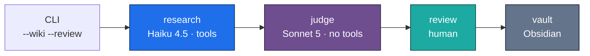
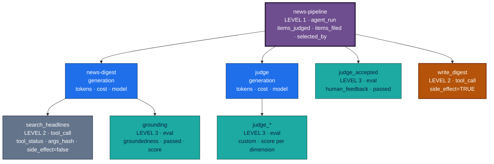
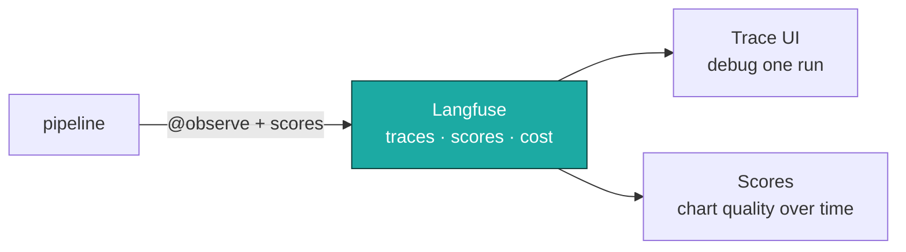

# Observability — news-agent

**How this pipeline is traced, and why each level exists.**

Three levels, numbered sequentially:

1. **`agent_run`** — one pipeline invocation, end to end
2. **`tool_call`** — every tool, with status, latency and side-effect flag
3. **`eval`** — guardrails and quality checks, emitted as *scores*

The field is `pipeline_level`, **not** `level`. Langfuse already owns `level` on
every observation (`DEBUG`/`DEFAULT`/`WARNING`/`ERROR` — it is the example in
the search box), and the trace UI labels tree depth `L0`/`L1`/`L2` as well.
Three meanings of one word on one screen produces a filter that silently
returns nothing, which reads as *"this never happened"* rather than as a typo.
`tool_status` is namespaced for the same reason: the sidebar has a Status
filter of its own. A test enumerates the reserved names and fails if any
emitted key collides.

What is deliberately *not* instrumented, and why, is at the bottom.

**One sink: Langfuse.** No Elasticsearch, no Cosmos, no Power BI, no Teams
routing. A single hosted store is enough for a project this size, and pretending
otherwise would be architecture theatre. Everything degrades to a no-op when
`LANGFUSE_PUBLIC_KEY` / `LANGFUSE_SECRET_KEY` are unset, so the pipeline runs
identically with no observability configured at all.

---

## What actually runs

All four stages share one `run_id`, bound once via `propagate_attributes` in
`orchestrator.run_pipeline`. Without it they would be unrelated observations in
the UI rather than one story.

---

## The trace tree

`write_digest` is the only amber box: it is the sole operation in the whole
pipeline that mutates state outside the process.

---

## Level 1 — `agent_run`

**One pipeline invocation, end to end.** Emitted by `orchestrator.py`.

| Field | Type | Why it exists |
|---|---|---|
| `items_judged` | int | How much was considered |
| `items_filed` | int | How much survived the floor |
| `selected_by` | `judge` \| `human` | Who made the final call |
| `error_type` | string | Exception class; present only on failure |

`outcome` is **not** in this metadata — it is emitted solely as a
`CATEGORICAL` score, because a score can be filtered and charted across runs
while a metadata copy is readable one trace at a time.

### Fields deliberately not emitted

Every one of these was a second copy of something the platform already holds.
A duplicated field is not free: it is one more thing to keep in sync, and when
the two disagree you have to work out which one lied.

| Dropped | Already available as |
|---|---|
| `run_id` | the trace's `session_id` |
| `duration_ms` | the span's own start and end |
| `total_cost_usd` | aggregated from `cost_details` on each generation |
| `generation_count` | the span tree, and it correlates with cost anyway |
| `human_intervention_count` | `selected_by`, which answers it and says who |
| `event_type` | `pipeline_level` — they were 1:1, so one of them was noise |
| `grounded` (on the research generation) | `ungrounded_sources == 0`, sitting next to the number it came from — and the `grounding_passed` score answers it chartably |

### Every terminal path maps to an outcome

| Outcome | When |
|---|---|
| `success` | Items cleared the floor and were filed |
| `goal_unmet` | Ran, produced nothing usable — no items cleared the floor, or research exhausted its iteration budget (`DigestError`) |
| `cancelled` | A person declined at the review step (`ReviewAborted`), or Ctrl-C |
| `application_exception` | The judge returned something unusable, or any unexpected error |
| `guardrail_block` | `--max-usd` stopped the run on purpose. Grounding failures are *reported*, not blocking, so they do not land here |

**Failures emit an outcome too.** Instrumenting only the success path gives a
dashboard with survivorship bias: every failed run is simply absent rather
than visibly failed. The exception still propagates unchanged.

---

## Level 2 — `tool_call`

**Every tool, with the one flag that matters.** Emitted by the
`telemetry.tool_call` context manager.

| Field | Type | Notes |
|---|---|---|
| `tool_name` | string | `search_headlines` or `write_digest` |
| `tool_status` | enum | `success`, `error`, `timeout` |
| `side_effect` | bool | **`true` only for `write_digest`** |
| `args_hash` | sha256[:16] | Raw arguments are never emitted |
| `error_type` | string | Exception class name; present only on failure |
| `feeds_ok` | int | How many feeds returned articles |
| `feeds_failed` | list | Named feeds that errored; **omitted when empty** |
| `feeds_empty` | list | Named feeds that parsed to nothing; omitted when empty |
| `conflicts` | int | Vault notes left alone; omitted when none |

**Feed health is the highest-value field here.** `article_count` is per
*category*, aggregated after five feeds are merged — so one dead feed out of
five still looks healthy, and `_fetch` swallows network errors by design. That
combination made the most likely failure in the system completely invisible.
The names go to telemetry and never into the tool result: that payload is
re-sent to the model on every subsequent turn, so anything added to it is paid
for repeatedly, and the model has no use for feed diagnostics.

No `latency_ms`: the enclosing span already carries start and end, so the
field would be a second and less accurate copy of the same measurement.
**Each tool therefore needs its own span** — `@observe` must wrap
`tool_call`, not sit inside it, because `tool_call` emits in its `finally`.
When the vault write had no span of its own, its Level 2 metadata landed on
the pipeline root and was then overwritten by Level 1: the only
side-effecting operation in the system was invisible.

Two things worth knowing:

**`side_effect` is the point of this level.** It is what lets you answer "which
runs touched the vault" without reading every trace. Reads and writes look
identical in a latency chart; they are not identical in consequence.

**Failures are recorded and re-raised, never swallowed.** A tool that fails but
still logs `success` is worse than no telemetry, because it actively misleads.

| Tool | Side effect | Emitted from |
|---|---|---|
| `search_headlines` | no — fetches RSS, mutates nothing | `agents/research/agent.py` |
| `write_digest` | **yes** — writes notes to the Obsidian vault | `sinks/obsidian.py` |

---

## Level 3 — `eval`

**Quality checks as scores, not metadata.** This is the level that earns its
keep: metadata can only be read one trace at a time, while a score can be
charted over time, filtered on, and aggregated across runs.

This pipeline produces three kinds of eval, and it already computed all three
before any of them were emitted:

| Eval | Type | Evaluator | What it answers |
|---|---|---|---|
| `grounding` | `groundedness` | `url-set-check` | Did the model cite sources the tool never returned? |
| `judge_significance` / `_novelty` / `_relevance` / `_evidence` / `_composite` | `custom` | `llm-as-judge:claude-sonnet-5` | How good was the material this run found? |
| `judge_accepted` | `human_feedback` | `human` | Did a person accept the judge's picks? |

Each emits up to two scores:

- `<name>_passed` — `BOOLEAN`
- `<name>` — `NUMERIC`

They are independent on purpose: a check can pass with a middling score.

Eval metadata carries `evaluator` and `eval_type` but **no `level`** — it
would be a constant `3` on every eval ever emitted, and a field with one
possible value teaches you nothing.

### Provenance: which version produced this score

Every generation also carries `app_version`, `prompt_hash` and
`model_resolved`. Without them a drop in `judge_accepted` is unattributable —
a prompt edit, a moved model alias and a code change all look identical.

`model_resolved` comes from the API response, not from what was requested:
`claude-sonnet-5` is a pointer, and catching the day it moves is the point.
The judge's hash covers its **weights** as well as its prompt, because the
composite is computed in code — re-weighting changes every score without
changing a single prompt token.

### Closing the loop

`judge_accepted` was being collected and never read. It now has a threshold
and a decision, in `evals/golden.py`:

| Acceptance rate | Decision |
|---|---|
| ≥ 90% over ≥ 20 runs | `drop-review` — the judge matches you; review is ceremony |
| 60–90% | `keep-reviewing` — useful, not trustworthy alone |
| < 60% | `fix-rubric` — the rubric does not match what you want |
| < 20 runs | `insufficient-data` — refuses to conclude |

`python -m news_agent --feedback` prints it. The rate is computed from golden
fixtures rather than a second telemetry store, so there is nothing to keep in
sync and no way for the two to disagree.

### Why `human_feedback` is the valuable one

`--review` produces a human verdict on the judge's output as a side effect of
someone doing their job. That is the single most expensive signal to collect in
most LLM systems, and here it is free. Over time `judge_accepted` answers the
question that actually matters: *is the judge worth its cost?*

If it trends to 1.0, the review step is ceremony and can be dropped. If it
trends down, the rubric in `agents/judge/config.py` needs work. Neither
question is answerable without this eval.

---

## What we deliberately do not implement

Being explicit about omissions, because an unexplained gap reads as an oversight.

| Not instrumented | Why not |
|---|---|
| Per-LLM-call events | Langfuse already creates a generation span per model call, with tokens, cost and latency. Re-emitting a parallel event would duplicate it at worse fidelity. |
| The Langfuse prompt registry | Attribution is the goal, not editing. `prompt_hash` changes exactly when the prompt does, with no network call on the hot path and prompts still living in the code. |
| A git SHA as the version key | There is no repository. And a SHA changes on commits that cannot affect output, making it a noisier grouping key than the hash of the prompt text. |
| Retrieval / RAG metrics | RSS keyword filtering is not retrieval. There are no embeddings, no chunks and no relevance scores, so `chunks_returned` or `relevance_p50` would be invented numbers dressed as metrics. |
| Return-on-automation KPIs | Needs a business baseline — what the manual process costs. This project has none, and a fabricated baseline is worse than an absent one. |
| Prompt-version joins | There is no prompt registry; prompts live in `instructions.py` and are versioned by git. |
| Provider lookup tables | Anthropic-only. A `provider_id` column with one value is a column that teaches you nothing. |
| dev/test/prod field gating | One environment, no PII. |

---

## Where it lands

| Signal | Where to look in Langfuse |
|---|---|
| One run end to end | Traces → filter by `session_id` |
| Everything at a given level | Filters → Metadata → `pipeline_level` = `1`/`2` (Level 3 is scores, not metadata) |
| Cost per run | Trace root, `cost_details` split by token bucket |
| Fabricated sources over time | Scores → `grounding_passed` |
| Judge quality drift | Scores → `judge_composite` |
| Is the judge worth it | Scores → `judge_accepted` |
| Which runs wrote to the vault | Spans → `side_effect = true` |
| A feed that died | Spans → Metadata → `feeds_failed` exists |
| Did a prompt change help | Scores → group by `prompt_hash` |
| Did the model alias move | Generations → `model_resolved` changed |

---

## Implementation

| Concern | File |
|---|---|
| Level model, enums, emitters | `../src/news_agent/core/telemetry.py` |
| Langfuse setup, `@observe`, no-op fallback | `src/news_agent/core/observability.py` |
| Cost maths per token bucket | `src/news_agent/core/pricing.py` |
| Tests (levels 1/3/4, no-op contract, broken-sink safety) | `tests/core/test_telemetry.py` |

Two invariants the tests enforce, because both fail silently by design:

1. **No keys → no behaviour change.** Every emitter is a no-op without a client.
2. **A broken sink never breaks a run.** Every adapter swallows exceptions —
   which is exactly why they need tests, since nothing else will ever tell you
   telemetry stopped working.
